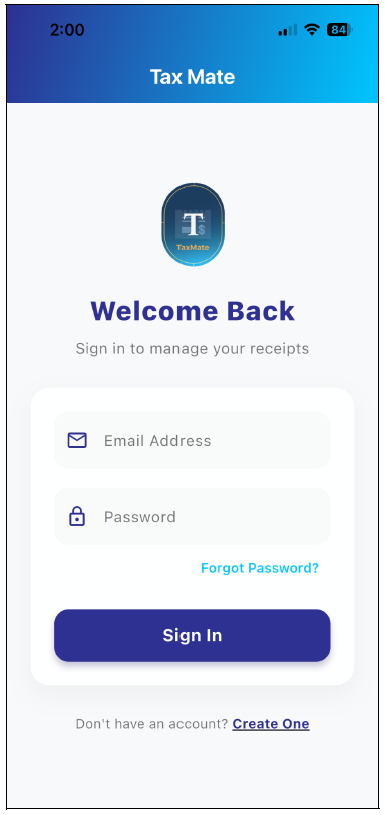
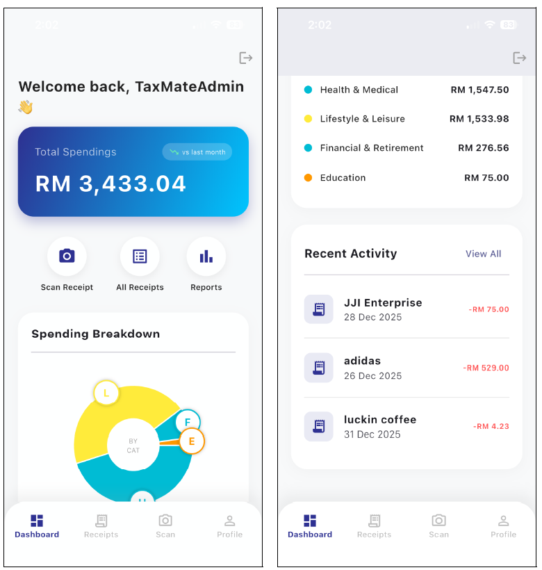
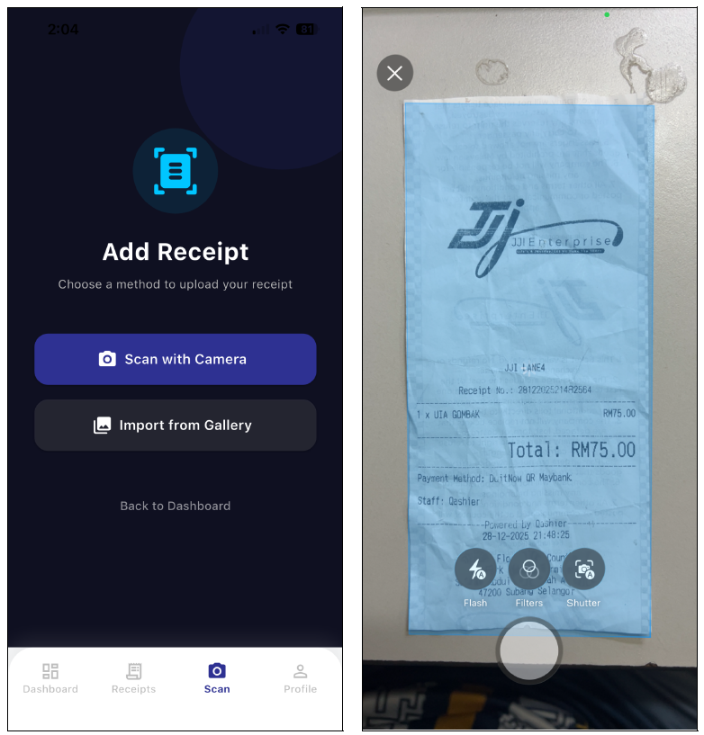
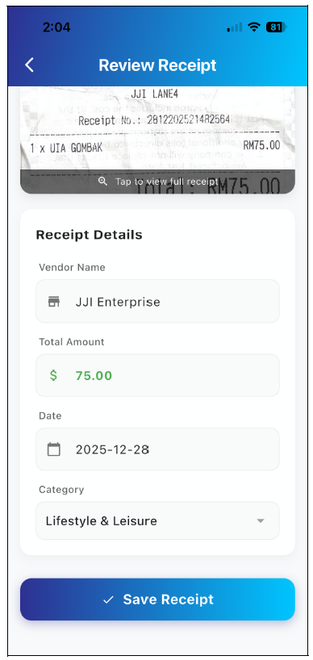
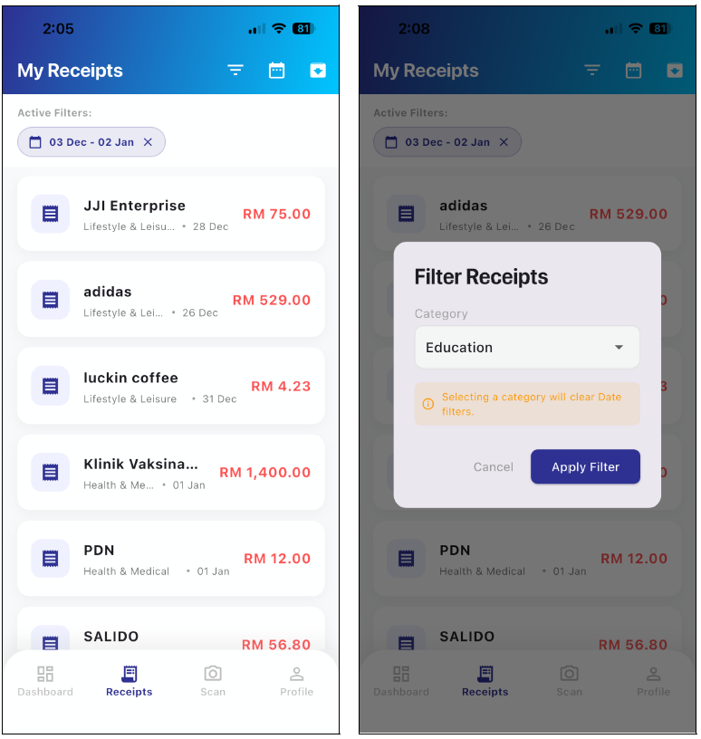
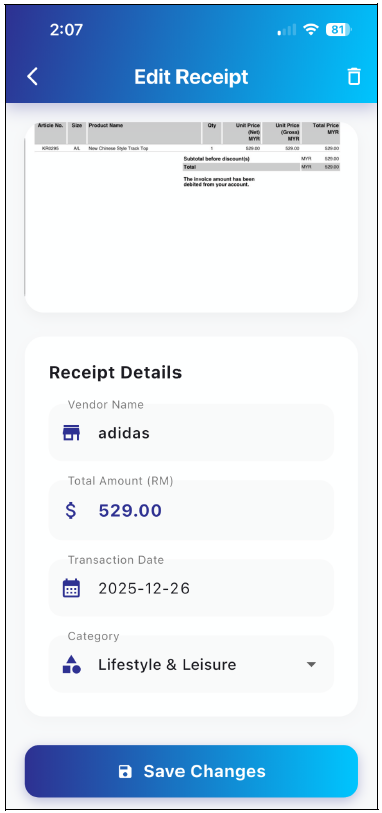
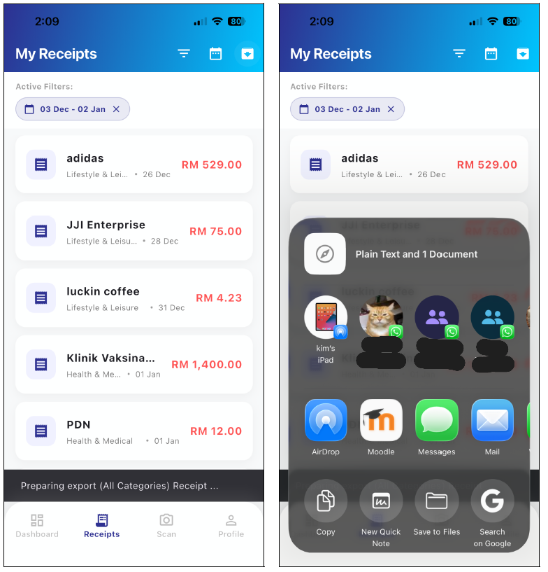
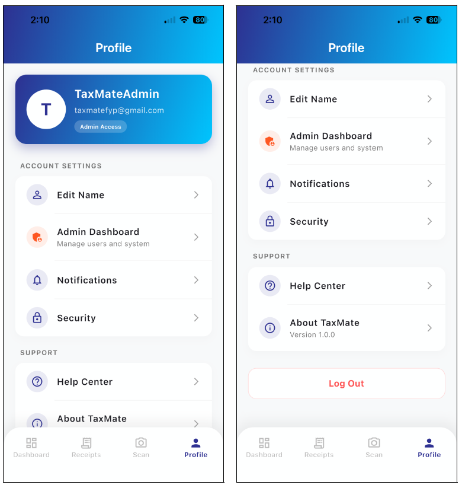

# 🧾 Receipt Management App

> **Final Year Project** > Scan receipts, view spending, and save categorized transactions for reporting.

  

## 📖 Overview

This project is a comprehensive mobile application designed to streamline personal expense tracking. It allows users to capture receipts via camera or gallery, utilizes OCR to extract transaction details, and provides detailed analytics on spending habits. It also features a robust Admin Panel for managing users and global categories.

---

## 📱 User App Interface

The user-facing side focuses on speed, ease of use, and visual data representation.

| **Sign In & Authentication** | **Dashboard & Analytics** |
|:---:|:---:|
|  |  |
| **Welcome Screen** Entry point for authentication. Includes secure email/password login and access to account creation or password reset. | **Overview & Summary** Main hub showing total spend, quick actions (Scan, Reports), and a Spending Breakdown donut chart with a recent activity feed. |

| **Scan & Capture** | **Review & Save** |
|:---:|:---:|
|  |  |
| **Camera Interface** Features a custom camera view with an adjustable crop overlay to improve OCR accuracy. Supports gallery import. | **Receipt Details** Users can review the captured image and edit OCR-extracted fields (Vendor, Amount, Date) before saving. |

| **Receipts List & Filters** | **Edit Transaction** |
|:---:|:---:|
|  |  |
| **History & Filtering** Scrollable list of all transactions. Includes active filter chips for date ranges and a modal for detailed categorization. | **Edit Mode** Detailed view allowing users to fix OCR errors, update categories, or delete receipts. Updates reflect immediately in analytics. |

| **Export & Share** | **User Profile** |
|:---:|:---:|
|  |  |
| **Reporting Flow** Generate CSV or PDF reports. Integrates with the system share sheet for AirDrop, Email, or Save to Files. | **Account Settings** Manage account details, security settings, and notifications. Admin users see a special badge and dashboard access. |

---

## 🛡️ Admin Portal

A dedicated suite of screens for system administrators to manage the application's ecosystem.

| **Admin Dashboard** | **Manage Users** | **Manage Categories** |
|:---:|:---:|:---:|
|  |  |  |
| **System Overview** High-level metrics including total users, upload volume, and transaction analytics. | **User Moderation** List view of all accounts with role badges. Admins can activate or suspend users here. | **Global Taxonomy** Add, edit, or remove global expense categories that apply to all users. |

---

## ⚡ Key Features

* **Smart Scanning:** Integration with camera hardware and OCR technology to automate data entry.
* **Visual Analytics:** Interactive donut charts and spending breakdowns to visualize financial habits.
* **Data Export:** Seamless export functionality for tax or reimbursement purposes (PDF/CSV).
* **Role-Based Access Control:** Distinct flows for standard Users and Administrators.
* **Category Management:** Flexible categorization for accurate budget tracking.

---

## 🛠️ Tech Stack

* **Frontend:** [e.g., Flutter / React Native / Swift / Kotlin]
* **Backend:** [e.g., Firebase / Node.js / Django]
* **Database:** [e.g., Firestore / MongoDB / PostgreSQL]
* **OCR Engine:** [e.g., Google ML Kit / Tesseract]

## 👤 Author

**G. Muslih** an
* [GitHub Profile](https://github.com/gmuslih)
